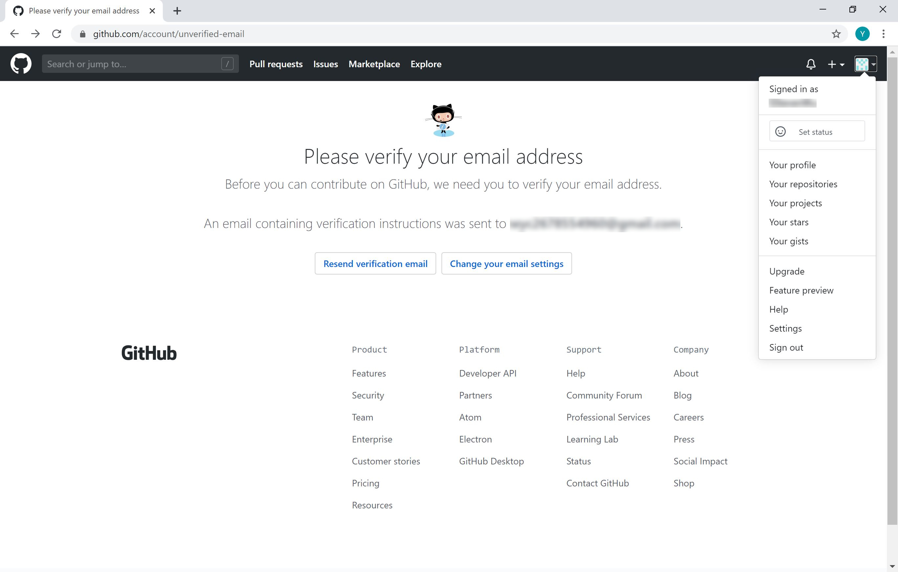
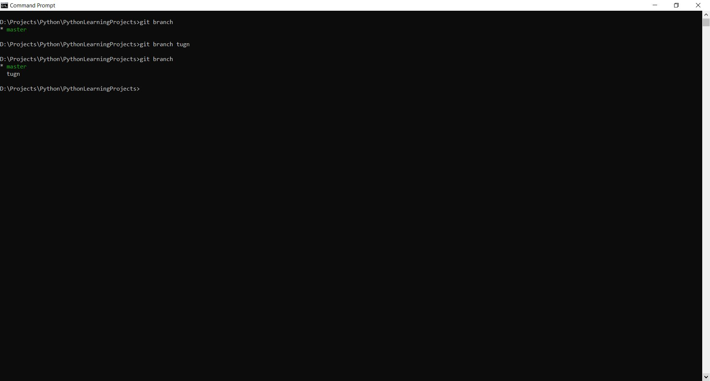
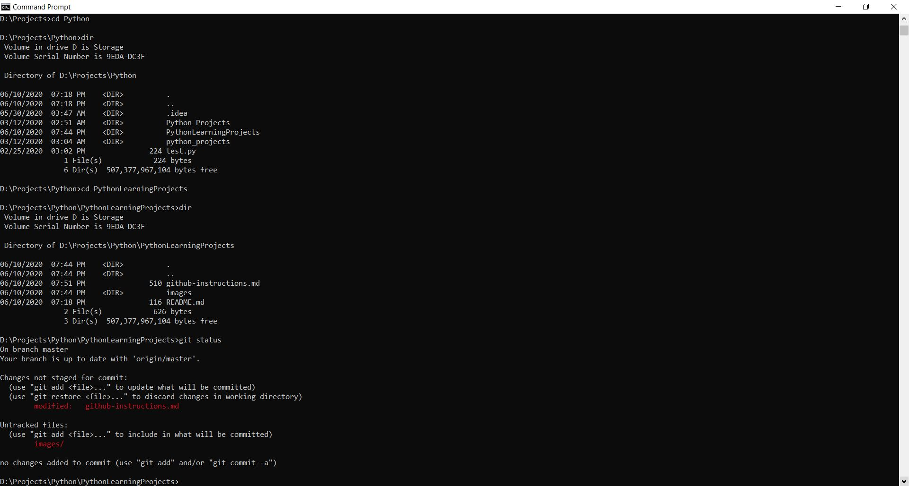

# GitHub First Timer Instructions

### Table of Contents
1. [Signing Up on GitHub](#signing-up-on-github)
2. [Setting Up GitHub](#setting-up-github)
3. [Operating Command Prompt/Terminal](#operating-command-prompt/terminal)
4. [Generating an SSH Key](#generating-an-ssh-key)
5. [Adding Public SSH Key](#adding-public-ssh-key)
6. [Cloning Repositories to Your Local Computer](#cloning-repositories-to-your-local-computer)
7. [Branching Git For Your Own Implementation](#branching-git-for-your-own-implementation)
8. [Pushing Your Files Back to Repositories](#pushing-your-files-back-to-repositories)
9. [Pulling Your Files From Repositories](#pulling-your-files-from-repositories)

### Signing Up on GitHub
Go to https://www.github.com  
As seen below in the figure attached, click sign up on the right corner.

Follow the steps required by GitHub to complete your registration and verify your email for full access to GitHub.

### Setting Up GitHub
After you have signed up for GitHub, go to the link below and install Git on your local machine.  
In order to be able to use Git commands, you will need to have Git installed on your machine.  
[Click here to download Git](https://git-scm.com/downloads)  

Once you are on the website shown in the figure above, you can either click on the "Download x.xx.x for (Your Operating System)" or choose your download manually under the Downloads section.  
After the download finishes, install it with pre-configured options or you can manually choose it if you know what you are doing.

### Operating Command Prompt/Terminal
Before going into how to use git, I would like to show you how to operate command prompt (Windows) and terminal (MacOS) first. However, the pictures shown will be on Windows OS as that is the only one I own.

In order to access command prompt, you have to go to your start menu on the lower left of the screen and type "command prompt" on the search bar. Click on it to open up the program. You will get something similar to the figure below.  

In this application, you will be able to use a multitude of commands to access and control your computer. But in this document, I will only teach you how to access files and use basic git commands for learning.

* C:, D:, E: - choose whatever drive you would like to be in  
* cd (change directory) - change your current directory to the folder that you would like to access, you can do this with the folder's name, or with . for current directory, .. for parent directory, and ~ for root (uppermost) directory
* dir (directory) - list out files and folders in the current directory (ls for MacOS)   

In both figures above and below indicate the actual usage of commands on my computer. First, I accessed my drive D because all of my files related to this project are in drive D. Then, I typed "dir" to see what files and folders are in my current directory and I used "cd" to change my path to the next folder closer to my project folder. I then repeated the process of using "dir" and "cd" until I reached my Python working directory.  

### Generating an SSH Key
After you have installed git from git-scm, you will also receive an application called, "Git Bash". For this part of the document, you will be opening "Git Bash" from your start menu again. Once you open application, you will see a screen like below.

The objective of this section of the document is to grant you access to pushing and pulling from GitHub. You will first type on your Git Bash, 'ssh-keygen -t rsa -b 4096 -C "{your email}"'. Once you type that in, it will start the process of generating an ssh key for your access to git. You will find the screen below showing up asking for what you'd like your file's name to be. Hit enter to use the default name. You'll then be asked to type the password to the file (Please remember the password because you will need it for pushing and pulling files from repositories). Also, while typing your password, don't worry if you don't see your password on the screen, they are actually already typed, keep typing.  

After you have input your file's name and password, you will receive a screen resembling the screen below.

### Adding Public SSH Key
After you have successfully created an ssh key, you will need to add your public key to your GitHub account to help identify your contributions. In order to do that, you will need to go back to your GitHub website, and click on your profile picture on the upper right as you see in the figure below.  

You will see the option "Settings", click on it and it will lead you to the figure below. Once you are here, you then go to "SSH and GPG keys" section.

In this section, you will see SSH keys and GPG keys that you can add. This is where you add your generated SSH key. Click on "New SSH key" on the upper right.

You will be led to the figure below and you can see that you can give a name to your SSH key that you are adding and a section to input your public key.

You will then go back to your Git Bash in order to copy the public key for GitHub. Before you copy the key, type "ls -al ~/.ssh" to check what ssh keys you have on your computer. If you use the default name, you should see "id_rsa" and "id_rsa.pub". You will want to copy the public key from "id_rsa.pub". Follow the command below "clip < ~/.ssh/id_rsa.pub" to copy your public ssh key.

Once you have your key copied, you will go back to the SSH key addition page you were on on GitHub. You will paste the key you have copied onto the "Key" section of the page. Then, you click "Add SSH key" to finish adding the key.

This should show you that you now have a new key in your SSH keys list.

### Cloning Repositories to Your Local Computer
In order to download the files from remote repositories (my files for you, initially), you will first need to use command prompt/terminal to navigate to the folder where you want the files to be first. Your first git command needed for this project will be "git clone".

Git:
* clone - clones or copies files from remote repositories that is specified to local directory that you are currently in for your local development.  

You will then type "git clone {link of the repository}", which in this case will be "git clone https://github.com/nathnet/PythonLearningProjects.git"

Your computer will then start loading all the files from remote repository to your local directory. You can verify once the download is done by either going to your folder directly or type dir/ls on your command prompt/terminal.

### Branching Git For Your Own Implementation
For this section, you will get to branch (create) your own branch of implementation on each project. To do this, you will learn a few more commands.

Git:
* branch - if used without any names followed, you will be viewing what branches are available to you. If used with a name after, you will create a new branch for development. If used with " -d {name}", that will delete the branch that was created.
* status - checks the status change in your files in the repository whether there are new files, folders, changes made to any files or folders or not.

In the figure below, I created a new branch called "tugn" and I checked what branches I had.

However, I wasn't satisfied by the branch I created! So I deleted the branch "tugn", checked the name of all my branches. Then, I created a new branch called "tung" and checked again. There I went! Finally properly named!

I then used "checkout" to access the branch I created. I checked for which branch I was on using "status" and yes! I was on tung branch. Now you can start implementing your own program! It will be developed separately from the main branch.

### Pushing Your Files Back to Repositories
Now comes one of the most important parts. After you have finished developing a part of your program, you would want to save your progress so you can go back to it if the new changes made to the program causes failure. In this section, you will learn some more git commands.

Git:
* add - records all your changes in the file(s) and moves them to staged area ready for uploading to the repository. You can use this with file's name such as "git add github-instructions.md" or with a "git add ." to add all files that have been changed.
* commit - after you have added files to staged area, you would want to mark it a milestone to your development. This is where git refers to when you want to go back to previous spot where the code works or where you want it to be. You use it as "git commit -m {your message to what has changed for your own reference}". This must be done only after you have added files to staged area.
* push - uploads all the commits you have made to remote repository that is connected to your local repository. This allows other developers to be able to see your implementation as well as mirroring it for your files' safety.  

Below I checked for what has changed in the local repository using the command "git status".  

The figure below shows that I have added all the files which I have made changes to, which were the images for this document and the document itself.  

After having added all the files to staged area, I committed the changes with the message "Update github-instructions and images".  

After having committed my changes, I pushed it to remote repository, which made all these documents available to all of you who are reading this.

I then checked again for what changes there were, only to discover that there were more changes... which were the screenshots of all these.

### Pulling Your Files From Repositories
Uploading may be an important part of project development, but you also need to know how to download the project when there are changes from online repositories as well.

Git:
* pull - downloads the information from the repository that the current directory is connected to. You can do "git pull" to pull from the connected directory or you can do "git pull {link of the repository}" to pull from a specific directory as well  

Here, I checked for what files currently exist in local repository and I found out that there were only github-instructions.md and README.md.

 However, I do know that there are more files now on remote repository than there were before. So, I used the command "git pull" to update my local repository with the up-to-date files from remote repository that is connected to my directory through the initial "git clone".

That is it for the basic Git usage. Happy Programming!

### More commands teaching later :P
